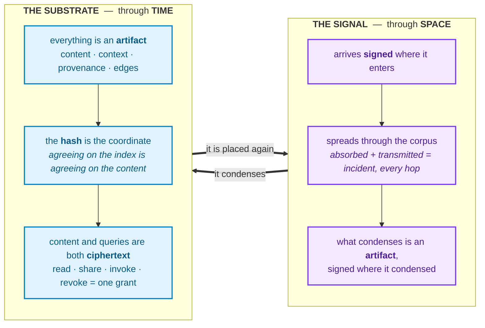
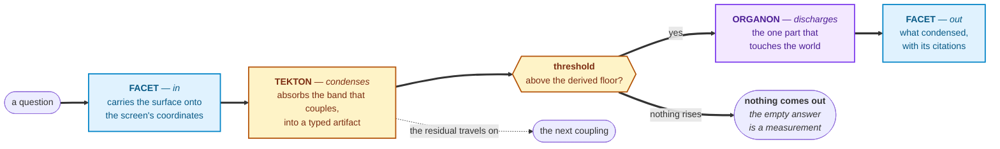
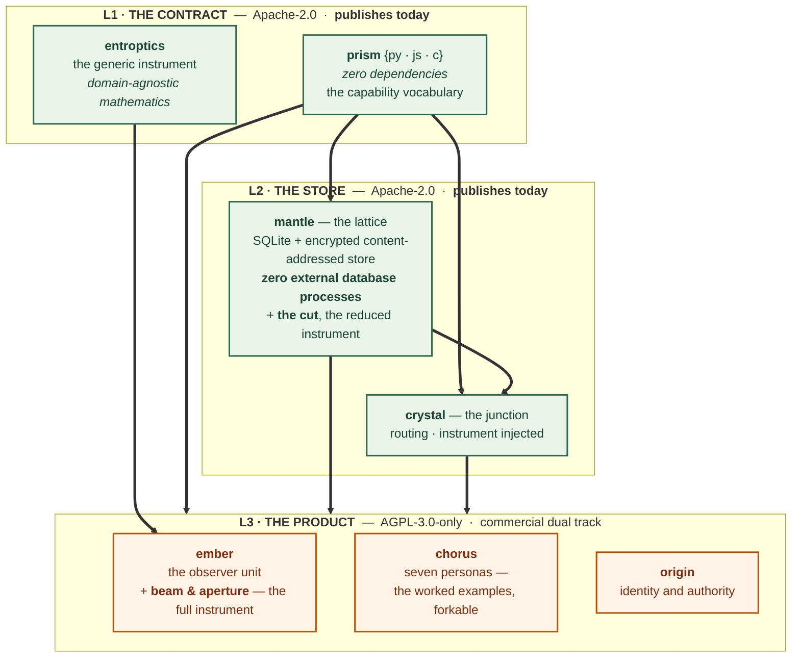

# AGIENCE + ENTROPTICS

## The universe, in focus.

**Agience · Ikailo Inc. · John Sessford**

---

## 1 · The core

Agience is infrastructure for knowledge that carries its own evidence. It rests on three things.

**Entroptics** is the instrument. It reads any ordered signal at the resolution the signal's own
entropy sets, and reports how much of it is real. Point it at a corpus and it decides which records
are the same thing. Point it at an answer and it decides whether the evidence supports it, or returns
nothing. It is parameter-free: the only external input is the reader's own tolerance for a false
alarm.

**Mantle** is the memory. A store that holds content under the hash of its own bytes, keeps every
version in its own ordered time, and encrypts what it holds so it cannot open it without a grant
that reaches it — ◧ *what it keeps in the clear is artifact metadata — title, description, tags — which is
grant-controlled; the search index itself holds no plaintext terms.* Authorization is reachability
across the graph, so revoking access is a single edit — ◧ *effective within the authorisation
cache's window, 30 seconds by default.*

**Agience** is the observer: the workflow engine, where an **ember** grounds a bundle on a prism and
runs the loop that turns signals into typed content, invokes instruments, and files what it learned
back into the memory. It is the same machinery at every scale — a browser tab and a corpus node
differ in mass, not in kind — and it is what makes the other two into a system rather than two
libraries.

Nothing in the answer path is a trained model, no threshold anywhere is chosen by hand, and every
number the system reports is derived from the data in front of it.

---

## 2 · The problem: six things we can no longer distinguish

Information is worth something only where there is a difference, and only while that difference is
still sharp enough to act on. What has been checked and what has merely been said. What sits inside
your walls and what sits outside them.

Differences like these do not maintain themselves. Holding one takes continuous work — somebody
recording why, somebody checking, somebody keeping the boundary — and when that work stops the
difference does not sit still. It smears. This is entropy in the ordinary physical sense:
distinctions even out unless energy is spent holding them apart. Not a failure of anyone's diligence;
the direction things run in when nobody is paying. An edge is smeared in an afternoon and takes years
to sharpen back.

Six have smeared far enough that the two sides now read as one thing, and between them they account
for most of what currently ails the handling of knowledge.

**A decision, and the reasoning behind it.** The constraint that ruled out the alternative is the
most valuable material a company produces and the least likely to survive the quarter — it leaves
with the person, and only the decision survives into the record. A well-reasoned call and an
arbitrary one are indistinguishable six months later, so the organisation pays again to re-derive
what it already knew.

**An answer, and its evidence.** Generated text arrives fluent, confident and unsourced, and looks
precisely like knowledge. Raise the volume without raising the provenance and the two become a single
substance — at which point an organisation is deciding on degraded copies of its own thinking.

**What was verified, and what was asserted.** Checking a claim costs far more than making one, and
that asymmetry is the entire mechanism: the cheap thing floods the expensive thing until they weigh
the same. What is left is a brand you are asked to believe, or a referee who can be captured, coerced
or switched off — which produces not universal trust but universal suspicion.

**Using your data, and exposing it.** The dominant architecture makes usefulness conditional on your
content — and your questions — crossing someone else's boundary. For a hospital, a bank or a law
firm, the *pattern of what you ask* is itself the disclosure. The line wears away through ordinary
use rather than through any breach.

**Many places to stand, and one.** A handful of providers now hold the compute, the models and the
data. Concentration is not a threat to the differences of jurisdiction, ownership and failure mode —
concentration *is* their absence. Alternatives that still look distinct increasingly share a
substrate, so there is nowhere genuinely separate to fail over to.

**Work that is attributed, and work that is absorbed.** Whoever holds the customer relationship
stands between the contributor and the customer and takes a percentage of every exchange. A
contribution that is credited and one that is quietly consumed arrive in the same condition inside
somebody else's product — which is exactly why the loss stays invisible to the party receiving it.

### One cure, for all six

These read like six separate industries' problems — knowledge management, AI assurance, data
residency, cloud strategy, trust and safety, creator economics. They are one problem wearing six
coats: **there is no substrate on which a claim carries its own evidence.** Every institution ever
built for that job — peer review, the notary, chain of custody, double-entry bookkeeping, the
audit — is work spent holding one of these differences in place, so that it is safe to act on
something you did not personally verify. 

Telling them apart again needs the same thing in every case: **the difference has to be measurable.**
A claim has to carry a weight that is *derived* rather than declared — computed from who is speaking,
which authority attests them, how much independent agreement has accrued, and what that authority can
actually support. Saying it louder moves nothing. Once a claim carries a weight, a record with its
evidence attached is a different object from one without, and a contribution that is attributed is a
different thing from one that is absorbed.

And this is where entropy stops being the diagnosis and becomes the instrument. The quantity that
describes how a distinction was lost is the same quantity that says how finely it can defensibly be
recovered — no finer, and no coarser. That is a statement about **resolution**, and resolution is
what Agience is built on.

**The universe, in focus.**

---

## 3 · The instrument

**Entroptics is an aperture.**  
**Entroptics is entropy + optics.**

Think of a camera. They say a picture is worth 1000 words, but the picture itself carries that distinction. How much detail you can defensibly claim from a photograph depends on the perspective and the bounds of the photograph. Claim more and you are inventing; claim less and you have thrown away something
that was really there. Every real instrument has that limit. Most software behaves as though it has none.

Entroptics turns that idea into a general-purpose instrument. Give it anything that has an order to
it — a radio transmission, a market feed, a run of physics measurements, a conversation, a
company's documents — and it reports:

- **how much of this is genuinely here**, as opposed to noise
- **how certain it is of that**, as a number that tightens as more arrives
- **how fast it is changing**
- **how strongly it relates** to anything else you point the instrument at

And one more, which is the property that matters: **when there is nothing there, it says nothing.**

*For the current state of any capability named here — running, built, or designed only — the
canonical page is [`../vision/roadmap.md`](../vision/roadmap.md).*

### What is unusual is what is *absent*

**There is no trained model, and no manually fitted resolution or signal threshold. The reader
supplies one number: the false-alarm tolerance they are willing to accept.**

The working resolution comes from the material itself. The instrument reads how much detail the data
can actually support and then operates at exactly that scale — finer would be invention, coarser would
throw away signal.

The line between signal and noise is not a number anyone chose. The instrument works out what pure
noise would look like *on this data, at this size*, and keeps only what stands above it. Change the
data and the line moves by itself. There is nothing to tune because there was never anything tuned.

It reports its own uncertainty. Ask it early and it will tell you the answer lies somewhere in a
wide range; feed it more and that range narrows on its own until it closes. A system that tells you
when it does not yet know is a fundamentally different proposition from one that always sounds
certain.

And nothing is lost or invented on the way through: what went in equals what was used plus what was
passed on, at every step, checked by arithmetic rather than promised in a design document. A leak
shows up as a number that fails to add up.

The instrument has been run against physics data where the correct answer was already known and
recovered it to the limit of the hardware's precision; against a large body of real particle-physics
configurations, where it located a phase transition; against live radio astronomy
data at full resolution, with no adjustment of any kind; and against a trained model's own output,
where it beat the standard method at deciding which evidence actually supports an answer. The
figures are set out in the companion papers.

What matters here is the shape of that result rather than any single number in it: **the same
instrument, with nothing changed between one field and the next.**

---

## 4 · The signal, the substrate, and the observer

Agience makes the same guarantee on three axes. **The Signal** moves information securely
through **space**; **the Substrate** holds it securely through **time**. They are reciprocal: what
the signal condenses becomes an artifact, and an artifact placed back on a screen becomes a signal.
Provenance is carried geometrically on both.

**And there is a third, which is not a component — it is the frame the other two are measured
relative to.** Space and time are the axes a system can sum over; that summing is what *objectivity*
would mean, and nothing finite ever stands there. The third axis is **the observer**, and it cannot
be summed away, because it is exactly where finitude lives: every observer is somewhere, and no
observer is everywhere.

> **Entroptics** carries information through **space**.
> **Mantle** carries it through **time**.
> **Agience** is the one who is **looking**.

So the architecture puts an instrument on each of the first two, and puts its trust machinery on the
third — identity, grants, and an authorization model named for what it is: the **light cone**, the
bounded horizon of what one observer can reach. That bound is the same object twice: *the limit of
what you can see, and the limit of what can be decrypted for you.* An observer who cannot reach a
thing cannot obtain its key.

Being finite is implemented here, not merely acknowledged. And the same machinery runs at every
size — a browser tab and a knowledge node differ in mass, not in kind — so *an* Agience is an
observer at any scale, and the system as a whole is one too.

**On the substrate side, three properties are worth attention.** Content and
queries are *both* ciphertext on the encrypted arm — ranked search runs over blind tokens, so the
storage layer performs the search without ever reading it, and one encrypted posting list serves both
the keyword and the semantic arm. ◧ *Both arms are unconditional — every artifact is indexed this way, with no feature flag and
no plaintext fallback: a node missing the prerequisites returns 503 rather than degrading.* Authorization is graph reachability over nine permissions (**C**reate, **R**ead,
**U**pdate, **D**elete, **E**vict, **A**dd, **S**hare, **I**nvoke, **O**wner), and confidentiality is
a *separate* key scheme whose recipients that reachability computes — keys are never derived from
traversal, which is exactly why **revoking is one edge edit with nothing re-encrypted**.

**On the signal side, the path is one route with no pipeline.** Each receiver absorbs the band that
couples to it and re-emits the residual; the measured coupling *is* the routing decision, so nothing
dispatches.

---

## 5 · What it reads, and what it costs to run

The same instrument, with nothing changed between one of these and the next:

| what it was pointed at | what came back |
|---|---|
| **manufactured signals**, where the answer was already known | the rule that generated them, recovered to the limit of the hardware's arithmetic — and, when there was deliberately nothing to find, a clean refusal to find anything |
| **particle physics** — a large body of real lattice configurations | the phase transition, located and certified, with the confined state cleanly separated from the free one |
| **dynamical systems** | the governing law of a system read off its own behaviour, at a small fraction of the parameters a trained network needs to approximate the same thing |
| **radio astronomy** — real fast radio bursts, at full instrument resolution | the burst itself, pulled clear of the noise and the interference, with no adjustment of any kind for the domain |
| **market data** | how many independent forces a price stream is actually carrying, as against how many a summary statistic reports |

**Figures, methods and negative controls for every one of these are in the companion papers.**

### The same guarantee, measured in four unrelated fields

*Every figure here is recorded with its method, its date and its qualifier, and the qualifiers
travel with the numbers — here and on every other surface.*

| field | what nobody chose | measured |
|---|---|---|
| **Retrieval**, with no trained weight in the answer path | no embeddings, no similarity cutoff | **2–8×** a lexical baseline where the question shares no words with its answer — *what-is* nouns **59/60 vs 7/60**, modifiers **41/60 vs 17/60**. ◧ *And where the query IS the answer's text, BM25 wins and should: 83/90 vs 90/90* |
| **The baseline itself** | — | reproduces published **BEIR** within **0.016**; the geometry reproduces published **Jiang–Conrath** on SimLex-999 at **ρ = 0.5935**. *The comparison is against the field's own yardstick, not a private one* |
| **Retrieval-augmented generation and the KV cache** | how many to keep is a measurement, not a hyperparameter | cut F1 **1.000** against cosine's **0.806** — an edge of **+0.194**, 95% CI [+0.099, +0.301]. At the cache, **94% of the oracle's attention mass at 10% kept**, scored in 8 dimensions instead of 64 |
| **Pharmaceutical measurement** | head-to-head against the reductions the industry actually uses, each with a known ground truth | **three wins, one recorded negative.** *The loss is published* |
| **Economics** | the clock is read, never legislated | **14.24, 81.56, 91.04** on three live streams; **13.02, 14.85** on two live conversations. Never one value, and never a declared one |

**Four unrelated fields, one untuned instrument, and no fitted constant in any of them.** That is
what makes *measured, never set, never chosen* a claim about the world rather than a claim about a
product.

### Where the same read goes next

None of these requires a new instrument. Each is the same aperture pointed at a different
ordered axis — which is why they are a roadmap rather than a research programme, and why several are
partnership-shaped rather than product-shaped.

| | the read |
|---|---|
| **Industrial sensors and process** | how much of a plant's telemetry is real signal and how much is the rig measuring itself — the distinction a threshold alarm cannot make |
| **Environmental monitoring** | transients and spectrum across an array of receivers spread over a long baseline, where the array is the instrument and no single station sees enough |
| **Plasma and fusion** | the diagnostic channels of a discharge read as one object, so the evolution of the event is resolved from the measurement rather than fitted after it |
| **Magnetic resonance imaging** | whether a scan has yet collected enough to resolve the image, so it can stop when the answer is there instead of running a fixed protocol to the end |
| **Brain–computer interfaces and neural signals** | intent, separated from the biological and instrumental background. A derived noise floor is worth more here than anywhere, because the background *is* the problem |

The instrument-side inventions are the subject of pending patent applications and may be licensed.

The pattern is the point: one instrument, any number of unrelated fields, nothing retuned in between
— and a known rule for when it wins. It beats a simple summary whenever the thing being decided has
several distinct explanations competing, and it ties when there is only one. **In the cases published
here it never did worse than the baseline it was compared against.** That is a statement about those
comparisons, not a guarantee for an untested one.

### What it costs to run

The instrument keeps a **fixed-size summary** of everything it has seen. That summary does not grow
as the stream grows — which is what "a finite aperture over infinite data" means in practice. The
consequences are the ones an operator cares about:

- **Cost per unit of data is flat.** Taking a reading is as cheap on the ten-millionth record as on
  the first, and it never needs the history back. Feeding it more data is linear; taking a reading
  does not depend on how much data there has been at all.
- **It runs on ordinary hardware.** No GPU is required. Where one is available the results are
  identical, so the choice is procurement rather than capability.
- **Two parties can pool evidence without exchanging data.** Combining two instruments' summaries
  gives exactly the result of having seen both streams together — so a group of hospitals, banks or
  agencies can reach a conclusion none of them could reach alone, and no raw record ever leaves the
  organisation that holds it. This is usually sold as a compromise and here it is an identity: the
  pooled answer is not an approximation of the combined answer, it *is* the combined answer.

**And the remaining cost is yours to set.** The size of that summary is fixed by how many features
you chose to look at — which is a decision about **zoom, depth, and how wide a slice of the signal
you selected**, rather than a property of the data itself. A coarse read across a narrow band is
close to free. Full depth across a wide beam costs more, and costs it predictably. The instrument
scales with the *question*, never with the archive — so an operator tunes spend against the answer
they actually need, on the same deployment, without a second product or a bigger machine.

---

## 6 · The architecture

Three layers. The rule that makes the commercial model work is the shape of the import graph itself.

Every arrow points upward into the copyleft layer and an Apache
component importing an AGPL one is impossible by construction.

The unit anyone installs is a **bundle** — a signed set of crystals with the prism they run on.
Inside a crystal there are three roles: a **facet** conducts a signal in and out and never transforms
the band, a **tekton** condenses the matched band into a typed artifact, and an **organon** is the
one part that touches the outside world, afforded at the prism. That is what makes a capability a
self-contained, invokable, shippable thing.

**A third-party developer imports nothing at all.** A bundle *declares* the host modules it may reach
for, as strings; the host binds those names to its own modules at boot, and the bundle is
hash-verified before it runs. So the licence question a developer would otherwise have to answer
never arises — and Agience-published and developer-published crystals travel the identical path:
same hash gate, same pin, same capability match. The only difference is provenance.

**Role is emergent, not configured.** A node holding a payments organon *with* a credential
discharges payments; the same node without it advertises nothing and refuses. Same code, same
install, different measured role.

**Interoperation is native rather than adapted.** MCP runs in both directions, and every MCP server
an organisation already operates is already an operator in this vocabulary. MCP supplies the
envelope; the instrument supplies the payload.

---

## 7 · Derived, not trained

The system reasons over **real artifacts** — the actual record, kept whole. A document, a message, a
measurement, a decision. Each one carries who put it there and under what authority, and each change
writes a new version rather than overwriting the old, so the thing a claim rests on is still there to
be read, in the state it was in when the claim was made.

That is not bookkeeping placed around the answer; it is what makes the weight in §2 computable at
all. A weight derived from who is speaking, which authority attests them and how much independent
agreement has accrued cannot be computed over material whose origin was stripped or whose history was
overwritten. Attribution and version are the inputs.

Everything downstream follows. Where a pipeline would reach for a trained model, Agience computes
from the artifacts in front of it — and every substitution is named:

| where a trained pipeline reaches for a model | what runs instead |
|---|---|
| learned tokenization | lexicon-driven segmentation and deterministic morphology |
| embeddings | a coordinate computed and projected onto a basis derived from your own data's spectrum |
| approximate nearest-neighbour retrieval | keyed lookup → BM25 → graph walk → aperture rerank |
| a reranking model | the resolved-mode count on the ordered candidate stream |
| summarization | categorical consolidation — the colimit of a diagram, members reconstructible |
| analogy | a commuting square, checkable and refusable, rather than a vector offset |

No trained model in the shipped answer path — and every answer walks back to the versions it stood
on.

---

## 8 · What spreads, and what monetizes

**The instruments spread; the product monetizes.** The split is enforced by the import graph in §6,
and it resolves into three surfaces:

| | licence | role |
|---|---|---|
| **entroptics** — the generic instrument | Apache-2.0 | the mathematics. Free to anyone, for any domain |
| **the cut** — *where does the set stop?* | Apache-2.0 | **the giveaway.** Subspace membership and a parameter-free relative-gap break: one complete question, answered fully, shipping with the open-source store so that a standalone store is genuinely useful on its own |
| **the beam & aperture** — the Agience wrapper | **AGPL-3.0-only** | **the hook.** Use it and your work is AGPL, or you take a commercial licence |

Copyleft licenses copyright, not trademark —
so replacing the brand always requires a commercial licence. Any company of any size may use the software free if it is compliant and non-white-label. The
agreements are drafted, and the exclusion list is what keeps the trigger defensible: custom domains,
SSO, infrastructure ownership and ordinary theming are explicitly not white-labelling.

**Patents are filed.** Applications are on file for the **Entroptics instrument**, with named
embodiments. They need review. Other parts are very likely patentable and have not been assessed — on the store side,
threshold quorum key issuance, hash-chained grant ledgers with auditable revocation, envelope
re-wrapping for cross-context sharing without re-encryption, and access-pattern obfuscation; on the
instrument side, domain adaptations of the read path and direct licensing of its components — the
aperture, the propagation-channel inverter, the read-side denoiser. **Engaging a patent agent is an
open action,** and the scope of what is protectable is not yet settled.

The shipped code carries the Apache grant, and the reserved inventions are deliberately not
implemented in the public repositories. A pledge travels with them — **for non-commercial and
research use every method is free, including the reserved ones** — which seeds the citation graph and
the talent pipeline at zero cost while keeping the commercial line bright.

Six constraints bound all of them, and they are the differentiation rather than a limit: **zero take
rate on operator revenue**; **a flat facilitation fee, never a percentage**, because a flat fee
leaves the exchange undistorted; **commerce never gates a customer's own data, export
or backup paths**; **secrets stay secrets**, which bounds what any hosted offering may ever do;
**physical couplings are measured, never set**; and **no token is sold to raise capital** — a
constraint that is unconditional and separate from settlement.

**The token, today and tomorrow.** Agience has an official token, predating this design. **Today it
is a holding** — a way to hold a position and show interest in what is being built. It carries no
claim on revenue, no governance right and no share. **Tomorrow, when the economy is implemented, it
is revamped and transferred into real value inside the ecosystem** — the unit that settles verified
work, dissipates as energy dissipates, and decays unless maintained. A measured economy has to settle
somewhere, so implementing it needs a crypto system, and that means relaunching the existing token
rather than issuing a second one beside it. The relaunch is a transfer conducted properly, with every
existing holder accounted for; the mechanism, timing and jurisdiction are open, the obligation is
not.

---

## 9 · What ships, and when

**The architecture is designed and understood.** What remains is deeper research in some domains, deployment, and the market surface.

**A pilot customer is going live.** The commercial model running against a real client.

**The foundation substrate deployment** at `mantle.agience.ai` is in progress.

**Then three horizons.**

**Horizon 1 — the knowledge platform.** Turn live work into attributable, durable truth. Each
line here stands alone at small scale.

**Horizon 2 — the open operator ecosystem.** Three tradeable resource classes on one substrate —
compute, transformation, knowledge, with operators keeping their IP and their
revenue. 

**Horizon 3 — non-custodial trust infrastructure.** The sovereign stack: multi-transport mesh,
cooperative DNS and addressing, and
the domain adaptations of the read path — MRI, brain-computer interfaces, fusion diagnostics via partnerships. Designed to outlive the company through exit, preferably as a community handover.

**The sequencing rule governs all of it.** You do not launch an economy. You launch products that
are **ten times better on one axis**, share one substrate, and each earn on their own at small scale.

---

## The questions this leaves open, answered

§1–§9 are the story. What follows is the residual — the part the story could not absorb
without stopping to explain itself: how a question actually becomes an answer, what is encrypted and
what is not, where it runs, what the economy does and does not do, and what a day looks like. Read
the ones you need; they do not depend on each other.

### How does a question actually become an answer?

A question arrives as text. It leaves as an answer with citations attached, or it leaves as nothing.
In between, five things happen, and **none of them is a rule someone wrote**.

**It is placed, not parsed.** The words become a frame — the same ordered object the instrument reads
anywhere else — and that frame is placed on a shared surface called a **screen**. From this point the
system is doing measurement rather than language processing.

**Each word's job is read off the corpus.** Whether a word names a thing or an action is decided by
what the corpus has actually seen: a word whose relational uses outnumber its naming uses is acting
as a relation here. There is no part-of-speech tagger, no verb list, no list of question words. Ask
about a corpus that has never seen a word used a particular way and the system will not pretend
otherwise.

**What kind of question it is falls out of where the hole is.** Every question has a hole in it —
that is what makes it a question. Where that hole sits relative to the rest decides whether the system
is being asked to *apply* something known, to *work backwards* from a result to its cause, or to
*infer* the relationship between two things it already holds. There is no flag anywhere in the system
that marks something as a question.

**The signal spreads, and weakens by measure.** Meaning propagates outward through everything the
corpus knows, attenuating with distance by one law that is used everywhere. It stops when it drops
below the level an *unrelated* pair of concepts would score on this same corpus — a floor the corpus
computes about itself. No hop limit, no depth setting. A hop limit would be somebody's guess about
how far meaning travels; the floor is a measurement of it.

**What matches condenses; the rest travels on.** Where the spreading signal meets something that
genuinely couples to it, that part condenses into a typed, citable artifact. What did not match keeps
going, available to something further on. Nothing is discarded silently.

**And when nothing rises above the floor, nothing comes out.** Not an apology, not a placeholder,
not a hedge. The empty answer is a measurement — it means the evidence for this does not exist in what I hold.

Two questions about the same subject can return different answers, and the reason is geometric
rather than procedural: the two signals met the corpus at different places. Nothing tested which
question was asked.

### Why "propagation" rather than a pipeline?

Because a pipeline requires someone to have decided, in advance, what talks to what.

In this system a signal is placed and then **spreads**. Each receiver absorbs the part that couples
to it and re-emits the remainder. The measured strength of that coupling *is* the routing decision —
nothing dispatches, nothing looks anything up in a table, and no component holds a list of the other
components it can reach.

Three practical consequences follow:

**It cannot be wired wrong.** There is no configuration in which A was supposed to call B and does
not. Coupling is measured at the moment, from the material.

**Backpressure is free.** A signal that nothing finds interesting simply fails to fire anything.
There is no queue to fill.

**Losing a message loses a thought, not a state.** A dropped signal is a thought that did not
happen; the observer that would have received it is uncorrupted. Contrast a remote procedure call,
where a lost reply leaves two parties disagreeing about what happened.

The accounting is what makes it trustworthy: at every step, what arrived equals what was used plus
what was passed on. The books balance across the whole chain, not just per step — a step that
balances against the *wrong* input still balances, so the check is done end to end. A leak shows up
as a sum that fails.

### Is the physics language a metaphor?

No — it is the reason the same code works in unrelated domains.

An economy, a supply chain, a conversation and a body of knowledge are all **ordered energy**. Each
has a direction it runs in and a set of channels it runs through, and that is exactly the shape the
instrument reads. So the same measurement that says *how much of this radio signal is real* also
says *how much of this claim is supported* and *what rate should apply where two ledgers meet*.

It is why one instrument covers every read listed in §5 with nothing changed
between them, and why a new domain costs an adapter rather than a new product.

---

# PART TWO — THE VOCABULARY

Eight units, one instrument, and a handful of words used inside them. Each is one idea.

### The eight units

| | |
|---|---|
| **Prism** | the environment an observer is grounded on — the hardware and what it can physically do: reach a network, touch a file, drive a sensor, render to a person. It also carries the protocol, implemented for Python, JavaScript and C. Its base install has **zero dependencies** |
| **Beam** | the signal object, and the aperture that reads it — the measurement of energy at a cut. Streaming, and adaptively forgetting |
| **Mantle** | the lattice — the store, and the ground. SQLite plus an encrypted content-addressed filesystem |
| **Crystal** | the junction. Condensation and routing: signal in, typed content out |
| **Chorus** | the operators, grouped by domain — and the worked examples a developer forks |
| **Ember** | an observer unit: crystals plus energy. The same machinery at every size |
| **Bundle** | **the installable** — a named prism, its crystals and an ember, signed as one thing |
| **Origin** | identity and authority, reached over the wire |

**Entroptics** is the instrument itself — the domain-agnostic mathematics the beam is built on. It is
a library rather than a unit, which is why it can be given away outright.

### Inside one crystal

| | |
|---|---|
| **Facet** | a view. It conducts a signal in and out and displays it, and it never transforms the band |
| **Tekton** | a tool. It condenses the matched band into a typed artifact — and it is a sink: what it absorbs stops propagating |
| **Organon** | a real-world capability — the hands. It requires both a grant and a physical capability the prism advertises. Many tektons need none |

Read by signal flow, a crystal is a transistor: **prism in, tekton gates, facet out.**

### Where measurement happens

| | |
|---|---|
| **Screen** | the ordered shared surface where signals meet and are read from either side. Two observers share one exactly when they place their lenses on the same instance |
| **Projection** | the screen as one side sees it, on that side's own entropy-matched grid — where absorption and transmission are read |
| **Transducer** | a stored conversion between a surface form and a concept. It is an artifact, so the conversion is inspectable and versioned |

---

# PART THREE — CONTROL, SECURITY AND DELIVERY

### Who can see what, and how is that enforced?

**Authorization is reachability, not membership.** There is no access list. Whether you can reach
something is decided by walking the graph outward from the grants you hold, following only edges
that carry the permission you are asking for.

Nine permissions travel on every edge — **C**reate, **R**ead, **U**pdate, **D**elete, **E**vict,
**A**dd, **S**hare, **I**nvoke, **O**wner. Each edge carries a mask saying which of the nine
propagate across it, so inheritance is a property of the structure rather than a rule applied on top
of it. Adding a document to a collection grants what the collection's edge permits, and no more.

Three consequences worth stating:

**Creating something grants you nothing.** Even the creator holds an explicit, revocable grant.
There is no owner fast-path to forget to check, because there is no owner field.

**Invocation uses the same walk.** Whether you may *run* something is the same traversal as whether
you may *read* it — the `I` permission, closed by default. Gating execution needed no new machinery.

**Asking about something you cannot see returns "not found", never "not permitted".** A missing
artifact and a forbidden one are indistinguishable from outside, so probing cannot confirm that
something exists.

And the property that makes revocation cheap: **reachability decides *who qualifies* to hold a key;
a standard key-sharing scheme then issues it.** Keys are never derived from the traversal itself.
That separation is the whole reason **revoking access is a single edge edit with nothing
re-encrypted**, ◧ *effective within the authorisation cache's window — 30 seconds by default* — a design that derived keys from the graph would have to re-key everyone affected
every time anyone lost access.

### What about secrets specifically?

A secret is visible to its creator and their runtime-assigned delegates. That is the entire list, and it holds **at
rest, in transit, in compute, in logs, and in backups**.

There is no platform exception, no support-mode peek, and no recovery path that widens the visible
set. Delegation is the only mechanism that adds anyone, and it is explicit and revocable. Secrets are
delivered already wrapped to the receiving server's registered public key, so a plaintext secret
never crosses the network at all.

### What is encrypted?

**Content is ciphertext.** Every artifact's body is encrypted at rest, under keys the storage layer
does not hold.

**The index holds no plaintext terms.** Search terms are one-way-transformed before they are
stored, each posting list is encrypted under a key derived from that transformed term, and ranking
happens in memory after decryption, in the process that already holds the grant. Every artifact is
indexed this way: the path is unconditional, and the store has no plaintext search index to fall
back to — its FTS5 module was removed as a privacy decision.

**What remains in the clear is the record, not the index.** An artifact's metadata and `context`
fields — title, description, tags — are stored readable and governed by grants rather than by
encryption. That is the exact scope of "encrypted by default": the content and the queries.

**Visibility is bounded to a locality.** The index is partitioned into encrypted cells, and material
routes to a cell by **similarity** rather than by name — so the store is organised by meaning rather
than by identity, and the key for a cell is derived rather than stored. A principal decrypts exactly
the neighbourhood their grants reach, and nothing adjacent to it. Collections are authorization
boundaries rather than encryption boundaries, which is why nobody has to choose what to search:
reachability decides what you may see, and similarity routing finds where the relevant material
actually sits.

### Can it be run somewhere we control?

Yes, and is best - for architectural reasons.

The system runs on-premises, in a sovereign cloud, at the edge, or **fully air-gapped**. There is no
call-home and no external licensing server anywhere in the data path — a disconnected instance keeps
working indefinitely, which is also why the anti-ransomware principle holds: **commerce is never
enforced by gating a customer's own data, export or backup paths.**

Residency is enforced at the data layer rather than by policy. Work marked for local handling cannot
select a remote capability, because a prism that does not advertise that capability simply does not
light the component that would need it. The system **refuses and names what is missing** rather than
falling back quietly to something that would have crossed the boundary.

Zero external database processes is what makes this practical: there is no second product to license,
harden and air-gap alongside it.

### How is it delivered and installed?

Installation is containerised and identical on every operating system — one script for Linux and
macOS, one for Windows, both doing the same thing: install Docker, fetch a compose file, run it.
**The compose file is the unit of release.**

That probe decides the profile. There are three:

| | environment | measures | stores |
|---|---|---|---|
| **edge** | browser extension, sensor, mobile | — | — |
| **store** | embedded application | **the cut** — the reduced instrument | |
| **node** | server, workstation, single-board computer | full instrument | |

Role follows the same rule one level up. Capacity is what gets installed; what a node actually *is*
follows from what it holds and can discharge — so there is no role to configure and no role to get
wrong.

### Does it work with what we already run?

Yes, in both directions, and the adoption path is unusually short.

The system speaks MCP as both a server and a client, so it exposes tools to your agents and proxies
your existing tools behind one uniform surface. An MCP server you already operate needs no rewriting:
its tools are already offers and its runtime requirements are already capabilities, so pointing it at
the gateway is what gives it discovery, permissions and metering.

Other protocols adapt through the three roles: a **facet** wraps the surface, a **tekton** condenses
what arrives into a typed artifact, an **organon** touches the outside world under a probed
capability. Everything else about an integration — registration, authentication wiring, dispatch, the
HTTP route — is derived from a short declaration, so the work of adding one is writing the
declaration.

### How does it spread across machines?

**Peers converge by comparing hashes, and that is the whole of synchronisation.** There is no
cursor, no checkpoint and no replication log to corrupt. A failed transfer simply leaves a mismatch
that the next round retries, so self-healing is the resting state rather than a recovery procedure.
Catching up and staying current are the same operation.

There is one send primitive — send *to an artifact* — and no fan-out. One copy is written; every
member finds it through their ordinary reconciliation. Delivery *is* reachability: a signal exists
for you if your grants reach the thing it was addressed to.

Two transport shapes cover every medium. A **plane** is anything you can put to, get from, and list:
memory, a shared directory, an S3-compatible bucket, an enterprise bus, the store itself — or a
physical drive carried between sites, where the only difference is latency. A **carrier** is anything
that broadcasts: radio, satellite. An adapter turns what a receiver hears into an ordinary plane, so
**the rest of the system never learns a radio was involved**.

The exactness of pooled evidence is what makes this useful across an institutional boundary rather
than only inside one: because two summaries combine to precisely the result of having seen both
streams, a mesh spanning several organisations is not a weaker instrument than a single machine
holding everything. It is the same instrument.

### Is there a way to message someone directly?

**Yes, and it needed no messaging feature — sending a message is the same operation as sharing
anything else: create an artifact, grant the recipient access to it.**

There is no chat server, no inbox and no separate protocol. A message is content like any other,
encrypted like any other, and delivery *is* reachability — it exists for the recipient the moment a
grant on it reaches their origin, and their side finds it through the same reconciliation everything
else uses. Addressing someone by name is addressing their origin.

Where it goes from "shared" to "instant" is that the grant can name a running ember rather than a
person checking later: the artifact arrives as a signal on the recipient's own screen, their tekton
condenses it the moment it matches, and a facet renders it — the identical path an answer takes,
not a special case bolted on for chat. Two people talking is two origins exchanging artifacts through
their own instruments; two agents talking is the same exchange with no human in the loop at all.

It inherits every property the rest of the system has rather than needing its own: **end-to-end**,
because content is ciphertext under keys the storage layer never holds; **peer-to-peer**, because a
plane is anything you can put to and get from — including nothing more than a shared directory
between two machines — so no server is required to exist; and **mesh-based**, because the same
hash-comparison convergence that keeps a knowledge base in sync carries a conversation, which is why
a message reaches someone whether they are online now or reconnect a week later.

### What are the personas?

Seven, each one a crystal with a name and a domain. They are Agience's own worked examples, written
to be read and forked rather than imported.

| | |
|---|---|
| **aria** | presentation — responses, cards, views |
| **astra** | ingestion — files, extraction, live streams |
| **iris** | networking — routing, channels, webhooks, relay |
| **lumen** | reasoning — grounded answers |
| **ophan** | finance and licensing — ledger, transactions, entitlement |
| **sage** | research — search, retrieval, synthesis |
| **seraph** | security and governance — policy, audit, identity, signing |

---

# PART FOUR — WHY IT WORKS

### What is the actual theoretical claim?

**That information has a natural resolution, set by its own entropy, and a system that respects that
resolution stays coherent at every scale.**

Describe something more finely than its evidence supports and you manufacture detail that is not
there. Describe it more coarsely and you destroy detail that is. At the natural resolution — and only
there — information can be read, stored and exchanged faithfully.

The consequence is that focus is **one operation** everywhere. How much of this signal is real, how
much of this claim is supported, and what rate applies where two ledgers meet are the same question
asked of different material.

### Why does entropy make it portable?

Because entropy is defined wherever information is, and it says nothing about what the information is
*about*.

Every read the instrument performs is derived from the material in front of it and tied to results
that hold for any carrier — nothing in the mathematics knows whether it is looking at radio, prices,
particles or prose. That is what makes a new domain an adapter rather than a rewrite, and it is the
reason the domain knowledge lives in a thin wrapper while the mathematics underneath stays general.

**Entropy implies information.** Anywhere you can measure the first, you can read the second.

### What is the mass gap, in ordinary terms?

**It is the minimum price of being a definite thing.**

In a world with a gap, the cheapest real thing still costs something. Below that price there is
nothing at all. In a world without one, everything shades continuously into everything else and
nothing has a crisp identity — which is exactly the condition §2 describes, six times
over, as things we can no longer tell apart.

So the gap is where information stops being a smear and becomes a distinct thing you can name, cite
and act on. Measuring it is measuring whether a body of information has identities in it at all.

### What does "existence is observer agreement" mean operationally?

That nothing in the system exists on its own authority.

Every record carries who observed it and when — a record without an observer is not a record. And how
strongly something exists is graded by how much independent agreement has accrued behind it, weighted
by the standing of the observers agreeing.

Two things make this work in practice rather than as philosophy. **Agreement is a weighted mean, not
a vote** — accurate observers move the answer, and inaccurate ones contribute variance that cancels.
And **agreement is computed for free**: two observers who independently observe the same thing
produce the same content address for it, so identical observations converge with no merge step and no
coordination at all.

This is also the limit, stated deliberately: agreement is not accuracy. Observers who share a
common source can agree tightly and be wrong together, and the system is built to test for that
rather than to assume it away.

### Why category theory?

Because it is the algebra of the operation the system performs constantly: **combining things that
turn out to be the same thing, without losing anything.**

The store is a collection of objects and the arrows between them. Consolidation is the search for the
smallest version of that collection which still answers every question the original could. When two
records are found to be one, they are not merged and discarded — a new object is created that both
map into, and both originals remain reconstructible from it.

The test for whether that was legitimate is arithmetic, not similarity: if the combined object did
not receive everything the originals had, the books do not balance and the merge is refused.

The result is a corpus that improves by getting **smaller and heavier** rather than larger — fewer
things, each carrying more evidence. That is the opposite of the accumulation strategy everywhere
else in the industry.

---

# PART FIVE — THE ECONOMY

### Is this a currency?

There is a ledger and there is a unit, and the unit is **a unit of account rather than a traded
asset.**

**It exists for an engineering reason before an economic one.** Metering work at the granularity it
actually occurs means transactions many times a second at fractions of a cent. A card payment costs
around thirty cents before it costs anything at all, and the money lands days later — so a one-cent
charge costs thirty-one cents to make. That is not an oversight; payment networks were built for
buying things, and they are good at it. They simply cannot express a hundredth of a cent a thousand
times a second, which is why every cloud has credits, every telephone company had billing units, and
every clearing house has its own unit.

**It is not issued to raise money.** There is no float, no issuance schedule, no price and no market
to speculate in. You obtain it by doing verified work, not by buying it. Nobody is asked to hold it,
and nobody is asked to bet on it.

**It is not one issuer's credit either.** Every participant keeps their own ledger, and that
plurality is the point: no global supply, no central clock, no single balance sheet to capture. When
two ledgers meet, **the exchange rate between them is measured, not negotiated** — two parties open a
boundary that says what may flow, value moves from higher potential to lower until they equalise, and
the rate falls out of the measurement rather than out of whoever has more leverage in the room.

**Distance costs.** Value moving between distant parties attenuates over the same correlation length
everything else uses, so transaction cost is a property of the path rather than a fee schedule.

The real ancestors are old and dull: mutual-credit clearing — WIR Bank has run one in Switzerland
since 1934, Sardex one in Sardinia since 2010 — correspondent banking's bilateral balances, and any
large firm's internal chargeback ledger. Bilateral books, netting, periodic settlement.

### Where does it settle?

**The substrate provides the edge, not the terms.** Value converts to ordinary money at two points —
when a buyer pays to consume something, and when a contributor cashes out — and *how and when* that
conversion happens is set by whoever operates the instance and the jurisdiction it sits in: a firm
running its own, a consortium, a regulated venue. The accounting is identical in every case; the
policy is theirs.

This is the same plurality the rest of the architecture has. There is no single venue to arbitrage
and no central operator to petition, which is why this describes an economic structure rather than
offering a financial product.

### What does the first deployment look like?

Not a global network. **One organisation optimising itself.** A firm takes a commercial licence,
stands up its own authority, and runs the accounting inside its own boundary: which work actually got
consumed downstream, which teams produce material others build on, which knowledge is load-bearing
and which has gone stale, where a decision's reasoning came from six months later.

That is a management instrument before it is anything else, and it answers a question large
organisations have wanted answered for a century: **where is value actually created here?** They can
federate with a supplier or a consortium later, on terms they set — **or never, and lose nothing.**
The economic layer can stay switched off entirely and the knowledge platform still works.

### What does the meter record?

**Verified work, and only verified work.** You cannot mine faster than you can verify. An asserted
claim carries nothing; a claim you checked, staked on and were right about carries weight — so there
is no way to manufacture value without doing the work the value represents.

| | what you do | why it cannot be faked |
|---|---|---|
| **contribute** | supply something real — a document, a reading, a measurement, knowledge only a person had | checkable against reality or its source |
| **verify** | stake your standing on a claim being right | you lose the stake when you are wrong |
| **refute** | disprove something false | you take the stake of the claim you overturned |
| **build** | write a useful operator | metered by real consumption downstream |
| **host** | provide compute, sensing or physical capacity | you did the physical work |

Two anchors are irreducible: **humans are the bottom of the meter** — attestation with something at
risk is the one thing no agent generates for itself — and **adapters are where the system touches
reality**. Everything between is provenance-tracked derivation.

The meter is not limited to knowledge work. Labour, a repair, a delivery, an hour of care: each is
work transferred between parties, and each raises the same three questions — **did it happen, who did
it, and what settles.** A factory is a host. So is a van. So is a person with a skill and an
afternoon.

**On gaming, the bound is stated up front: expensive, non-scaling and self-exposing — not
impossible.** The load-bearing part is that there is no privileged frame. Standing is not a global
score; it is your standing *in one observer's frame*, derived from that observer's own history of
checking you. An observer who has never checked you carries you at zero, so a ring of accounts
vouching for each other inflates its standing only inside its own bubble — and sustaining anything
gained that way costs sustained real work, at which point it is no longer gaming.

### Why declare an economy instead of designing one?

Designed rules can be gamed; conservation laws cannot. A rule is somebody's choice, so there is
always an angle on it. To break energy conservation you would have to break the fact that a unit of
work buys the same tomorrow as today — and you cannot lobby that. So the move is to **declare the
symmetries and let the accounting fall out**.

| symmetry | what is conserved | in practice |
|---|---|---|
| the value of work does not depend on *when* it was done | **energy** | a unit of verified work buys the same tomorrow as today |
| authority cannot be laundered into being | **standing** | you cannot declare yourself trusted and have it stick |
| a claim is what it hashes to | **identity** | no forging, and no arguing about which version we mean |

### Does value evaporate?

**No. Nothing is destroyed.** Value here behaves the way energy does, because it *is* energy —
conserved, never lost. What changes is how much of it is **free to do work**. Value in circulation
stays ordered and spendable. Value parked and unmaintained does not disappear; it disorders, the way
heat spreads out of a warm cup into a room. Every unit is still there. It is simply doing less.

Reconcentrating it costs work — which is precisely why maintenance, re-verification and
re-observation earn. The same is true of knowledge: material that stops being maintained **cools**
rather than being deleted. It stays true and stops being cheaply usable. The system does not penalise
holding; it declines to pretend that unattended value stays as sharp as attended value.

**And the rate is measured, never legislated — to the point of refusing to act without one.** Where
no cooling rate has been measured, *nothing cools*. The implementation returns "unmeasured" rather
than a default, because a plausible constant is a chosen answer that fires precisely when nobody is
looking. "Nobody has measured the clock" and "the clock is forty" are different statements.

### What changes for existing markets?

Very little, and deliberately. This is an accounting layer for what existing markets have never
priced, and it defers to them everywhere they work.

**It prices what markets price badly.** Markets are excellent at rival goods and poor at non-rival
ones, where the scarcity is not the thing but the verification of it — which is why attribution,
provenance, curation and care have never had working price discovery. Bread still costs flour and
hours, and this says nothing about the price of bread.

**Capital ownership is untouched.** A factory is a host: you own productive capacity and earn on the
work it performs. What is exposed is narrower — the **coordination premium**, the margin that exists
because establishing trust between strangers is expensive. Returns on productive assets are
unaffected; returns on being the only party who knows who to trust are the ones that compress.

Most of what a large intermediary provides is a substitute for trust: brand is "trust us, we
checked"; internalising transactions is "coordinating this ourselves is cheaper than finding out who
to trust". Each is a workaround for the absence of verifiable provenance, and each disintermediates
when verification becomes cheap and portable — not because anyone regulates them away, but because
the thing they compensated for has been fixed. That is why **zero take rate** and **a flat fee** are
structural rather than generous.

**Compliance gets easier.** Every movement of value is a recorded edge carrying who, when, and under
what authority — the audit trail *is* the data structure rather than a report assembled afterwards.

**And it strengthens sovereignty rather than routing around it.** Authorities are plural and
jurisdictional: a regulator, a central bank or a standards body runs its own, with its own policy,
inside its own borders, on infrastructure it controls.

### Where this is heading

*Direction, not product: not what ships or is being built, but what the structure implies if it
spreads.*

**The work that is worst compensated today is worst compensated because nobody could verify and
attribute it.** Care, craft, maintenance, teaching, the person who noticed the problem before it
became one — not undervalued because society fails to appreciate them, but because there has never
been a mechanism to establish *that they happened, that they mattered, and to whom*.

Where capabilities are advertised and needs are put into the field the same way, the two meet without
anyone assigning the work. Where an act lifts more across everyone it reached than it cost the actor,
**that surplus mints** — new value backed by verified improvement rather than by decree or by burning
electricity on puzzles, and attested by the only people who could attest it: the beneficiaries. You
cannot self-attest impact.

And where standing is **yours and portable** rather than held by one employer, losing a single
relationship is a smaller event than it is today. That does not abolish hardship and is not offered
as though it does. It changes the shape of the fall, from a cliff to a slope.

### Who governs this?

**The mechanism needs no governing.** Conservation, decay and physical couplings are measured, and an
authority exposes **no admin control** over them: no dial for the exchange rate, no
override on the decay clock, no setting that makes a claim weigh more. A measurement is not a policy
surface.

**Values are a different object.** What an authority will vouch for, what may flow, what consent is
required, what fees apply — those are written by people, are public and inspectable, and are
governed. Physics handles the accounting; **the authority handles the *should*.** Governance sits at
the level of borders and published policy, never at the level of judging individual cases.

**Most decisions never reach a person, and the boundary is detected rather than declared.** A
question is self-resolvable when repeated careful measurements settle toward a stable value, and is
not when they refuse to. **The failure to converge is itself the escalation signal** — there is no
list of "questions requiring human review" for anyone to maintain. Each time a person resolves
something the machinery could not, that resolution joins the standing structure and the same question
answers itself next time.

**But convergence alone is not permission.** A loop feeding on its own output amplifies its own
assertions until it is confidently wrong. A loop grounded in measurement converges only **if the
observers' errors are independent** — and correlated evidence produces exactly the stable, low
variance agreement that looks like convergence and is a shared mistake. So convergence *promotes* a
candidate policy; before autonomy is granted the agreeing set is tested for independence, tracing
whether the agreement runs back through a common lineage. In one line: **declare the symmetries,
measure what converges, check the agreement is independent, and ask a person what is left.**

**Governing weight is merit alone** — earned by verified contribution, **non-transferable**, and it
**decays**, so influence must be continuously re-earned. A stake is an anti-spam bond: paying more
buys no more say. Policies are artifacts; they cool like everything else, so a rule nobody defends
stops being in force rather than persisting because no one removed it.

**There is no global referee.** Universities, hospitals, regulators and communities each run their own
authority with their own policy, and trust is contextual. An institution that vouches for poor work
finds its attestations discounted — **the market prices validation quality, so we never have to.**

### What the economy will not do

**Money, voice and truth stay three different things.** Money is transferable and at risk. Voice is
earned, decays, and **cannot be transferred at all** — there is no transaction type for it, so
capital has no path to control. Truth is measured, owned by nobody, bought by nothing. A stake is the
single place money touches truth, and only as accountability at risk: **a larger bond never makes a
claim more true.**

**Nobody is conscripted onto a meter.** Using it is a choice, made per exchange, by the people in it.
A gift stays a gift. What changes is that the option to be paid properly now exists for work that
never had it.

**Power has to be re-earned.** Because standing decays, an accumulated position cannot be held
without continuing to do the work that earned it — an anti-oligarchy mechanism built out of
thermodynamics rather than term limits, and it applies to us as much as anyone.

---

# PART SIX — ONE VERSION OF THE FUTURE

Predicting a decade out is a way of being wrong in public. What follows is narrower: **what changes
in ordinary working life if the mechanics Agience is built on hold**, and where the work that would get
it there still sits. It is one version, not a forecast.

### What a day looks like

Start from what is left. If most of the derivation is done by machines, the remaining work is what
machines cannot do — and that turns out to be a longer and more ordinary list than "supervising the
machines".

**Being somewhere.** Adapters are where the system touches reality, and a person with two hands is
one. Someone has to be at the flood, at the substation, at the bedside, at the door. Physical
presence is not a residue left over after automation; it is one of the two anchors the whole meter
rests on, and it is the one that cannot be derived from anything else.

**Deciding what measurement cannot.** The machinery escalates by failing to converge, so what reaches
a person is exactly the set of questions no amount of further measuring settles — trade-offs between
things that are both real, and calls where the disagreement is genuine. That is a smaller volume of
decisions than today and a heavier one.

**Care, cooking, cleaning, keeping people well.** Part Five's claim, cashed out: this work is badly
paid because nobody could establish that it happened, that it mattered, and to whom — not because
society mysteriously fails to value it. Give it a verification path and it becomes compensable for
the first time. The person who sat with someone through a bad week did work; the beneficiaries are
the ones who can attest it, and they are right there.

**Sharing what you have instead of owning one each.** A host is anything that converts input into
work — a van, a spare room, a workshop, a drill, an afternoon. Advertising a capability and having
needs meet it directly is the same mechanism that matches a compute node to a query, applied to a
street. Utilisation goes up without a platform taking a cut for making the introduction, because the
introduction is what the field does.

**Turning up when it matters.** A large need pulls hard, and the response is many people covering
many short distances at once — the neighbour with the chainsaw, the person with the truck, whoever is
closest. Nobody assigns it. What changes is that afterwards there is a record of who did
what, so the response is not purely voluntary and purely forgotten.

**Participating — in markets, in research, in the argument.** Matching offers to needs, checking
someone else's work, contributing an observation, disputing a policy that is wrong. These are the
activities that keep a community running and none of them has ever had a way to accrue to the person
doing them.

And the knowledge-work version of the same shift, for the people whose day is currently spent on it:

**Checking becomes instant, so judgment becomes the job.** Establishing where a claim came from is
hours of work today, which is why almost nobody does it. When provenance is structural that cost
collapses, and the scarce skill stops being *finding out whether this is true* and becomes *deciding
whether it matters*.

**Careful work starts paying.** The person who corrects an error or notices two records are the same
thing currently produces value that evaporates on contact. Here each act is recorded and earns when
later work draws on it — paying the reviewer and the maintainer on the same footing as whoever
produced the original volume. Those are exactly the roles the last twenty years of software quietly
defunded. Because knowledge cools, keeping it warm becomes an occupation with a measurable output.

**Expertise becomes rentable without being surrendered.** A specialist's method ships as a sealed
component: the customer runs it inside their own walls, gets the answer, and never receives the
method; revocation is a key exchange that stops answering. That dissolves the consultant's oldest
dilemma, and lets small firms sell into accounts that would never let them near the data.

### What becomes cheap, and what becomes scarce

| becomes cheap | becomes scarce |
|---|---|
| establishing where something came from | deciding what is worth attention |
| finding whether two records are the same thing | genuinely independent observation |
| proving you did the work | willingness to stake something on being right |
| running the same analysis in another jurisdiction | uncorrelated evidence — sources that do not share an origin |

That last row is the deep one. When agreement is cheap to manufacture, **independence becomes the
expensive input** — and this system's most unusual property is that it measures whether the observers
agreeing with each other got there separately.

### Where the open work is

Predicting how people will feel about a system that does not exist yet is not worth much. What is
worth stating is where the interesting work sits — because these are the places that need running
models, real domain expertise, and research partners, and several of them are more interesting than
the parts already settled.

**Measuring independence.** A group of observers agreeing tells you very little if they all read the
same source. Distinguishing genuine independent agreement from one observation reported many times is
the single most valuable measurement in the whole design — it is what decides when the system may act
on its own conclusions, and it is the difference between a system that converges on truth and one
that converges confidently on a shared mistake. Tracing agreement back through shared lineage and
auditing where dissent comes from is active work, and it generalises far past this platform.

**What counts as verified work.** Value here is defined by the work something does downstream, which
invites the obvious attack: manufacture the consumption. The structural defence is that consumption
from established participants counts and anonymous consumption is worth approximately nothing — but
this is **unsolved for everyone working on it**, in every system that has tried to price contribution,
and we treat it as an open research problem rather than a solved one.

**The joint frame between two authorities.** For two parties to measure an exchange rate between
their ledgers, both have to present their flows on a shared axis. Defining that frame — which
features each side exposes, what they co-register on, at what resolution — is one well-specified
instrumentation task, and until it exists the cross-party rate is simply not computed rather than
approximated. It is the piece that turns two independent economies into a market.

**Running the economics as a model.** The laws are exact and testable as pure functions. Watching how
they behave at population scale — how decay rates settle across different kinds of material, what
re-verification actually costs to sustain, how standing distributes over time — is simulation and
measurement work that wants economists as much as engineers.

**Domain adaptations.** Pointing the instrument at medical imaging, neural interfaces or fusion
diagnostics needs the people who know those signals. Each is a collaboration with a group that
already holds the data and the physical intuition, structured as a partnership rather than as a
product build.

**Adversarial economics.** Gaming is expensive, non-scaling and self-exposing. That is the measured
bound and it is deliberately not "impossible" — anyone claiming a system nobody can game is
describing something that has not been adversarially tested. Testing it properly is continuing work
and it improves with more attackers, not fewer.

---

**The universe, in focus; Create your agency**  
